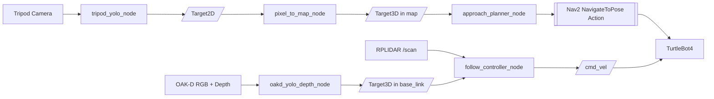

# System Architecture

이 프로젝트는 크게 두 단계로 움직입니다.

1. 삼각대 카메라가 멀리서 RC카를 찾고, 그 위치를 지도 좌표로 바꿉니다.
2. TurtleBot4가 그 근처까지 간 뒤, 로봇의 OAK-D depth camera로 RC카를 따라갑니다.

```mermaid
graph LR
    TRIPOD[Tripod Camera] --> TRIPOD_YOLO[tripod_yolo_node]
    TRIPOD_YOLO --> TARGET2D[/Target2D/]
    TARGET2D --> PIXEL_MAP[pixel_to_map_node]
    PIXEL_MAP --> TARGET_MAP[/Target3D in map/]
    TARGET_MAP --> APPROACH[approach_planner_node]
    APPROACH --> NAV2[[Nav2 NavigateToPose Action]]
    NAV2 --> TB4[TurtleBot4]

    OAKD[OAK-D RGB + Depth] --> OAKD_NODE[oakd_yolo_depth_node]
    OAKD_NODE --> TARGET_BASE[/Target3D in base_link/]
    LIDAR[RPLIDAR /scan] --> FOLLOW[follow_controller_node]
    TARGET_BASE --> FOLLOW
    FOLLOW --> CMD[/cmd_vel/]
    CMD --> TB4
```
