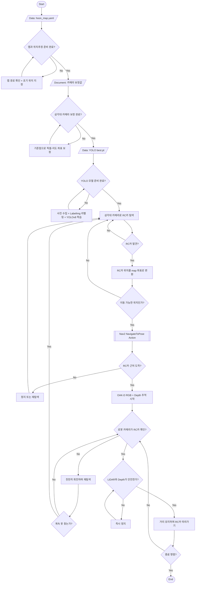

# Flowchart

```mermaid
graph TD
    START([Start]) --> MAP[/Data: hoon_map.yaml/]

    MAP --> MAP_OK{맵과 위치추정 준비 완료?}
    MAP_OK -->|No| SETUP_NAV[맵 경로 확인 + 초기 위치 지정]
    SETUP_NAV --> MAP_OK
    MAP_OK -->|Yes| CALIB[/Document: 카메라 보정값/]

    CALIB --> CALIB_OK{삼각대 카메라 보정 완료?}
    CALIB_OK -->|No| CALIB_PROC[기준점으로 픽셀-지도 좌표 보정]
    CALIB_PROC --> CALIB_OK
    CALIB_OK -->|Yes| MODEL[/Data: YOLO best.pt/]

    MODEL --> MODEL_OK{YOLO 모델 준비 완료?}
    MODEL_OK -->|No| TRAIN[사진 수집 + LabelImg 라벨링 + YOLOv8 학습]
    TRAIN --> MODEL_OK
    MODEL_OK -->|Yes| WAIT[삼각대 카메라로 RC카 탐색]

    WAIT --> SEEN{RC카 발견?}
    SEEN -->|No| WAIT
    SEEN -->|Yes| MAP_POS[RC카 위치를 map 좌표로 변환]

    MAP_POS --> GOAL_OK{이동 가능한 위치인가?}
    GOAL_OK -->|No| WAIT
    GOAL_OK -->|Yes| NAV_ACTION[[Nav2 NavigateToPose Action]]

    NAV_ACTION --> ARRIVE{RC카 근처 도착?}
    ARRIVE -->|No| NAV_RECOVER[정지 또는 재탐색]
    NAV_RECOVER --> WAIT
    ARRIVE -->|Yes| OAKD[OAK-D RGB + Depth 추적 시작]

    OAKD --> OAKD_SEEN{로봇 카메라가 RC카 확인?}
    OAKD_SEEN -->|No| SEARCH[천천히 회전하며 재탐색]
    SEARCH --> LOST{계속 못 찾는가?}
    LOST -->|No| OAKD_SEEN
    LOST -->|Yes| WAIT

    OAKD_SEEN -->|Yes| SAFE{LiDAR와 Depth가 안전한가?}
    SAFE -->|No| STOP[즉시 정지]
    STOP --> SAFE

    SAFE -->|Yes| FOLLOW[거리 유지하며 RC카 따라가기]
    FOLLOW --> END_CHECK{종료 명령?}
    END_CHECK -->|No| OAKD_SEEN
    END_CHECK -->|Yes| END([End])
```
